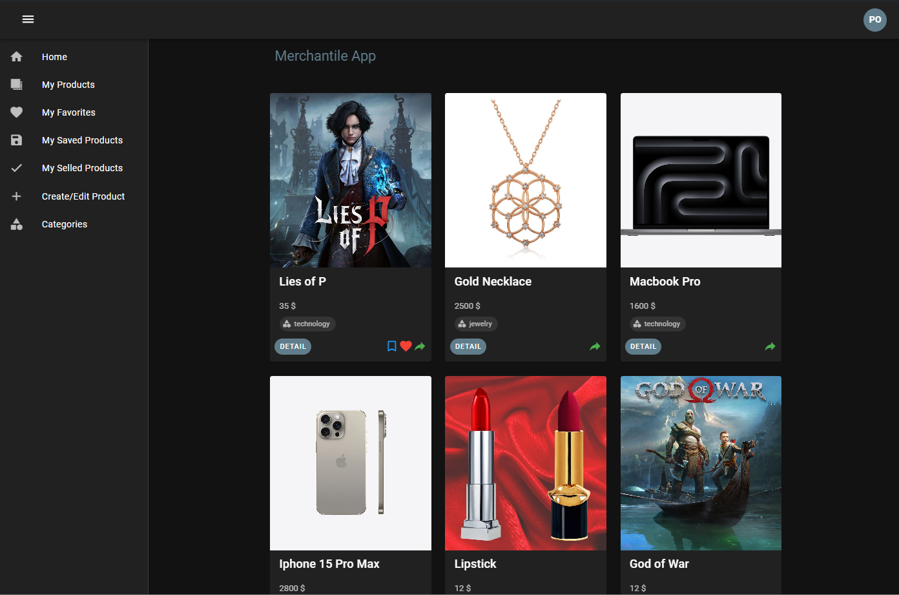
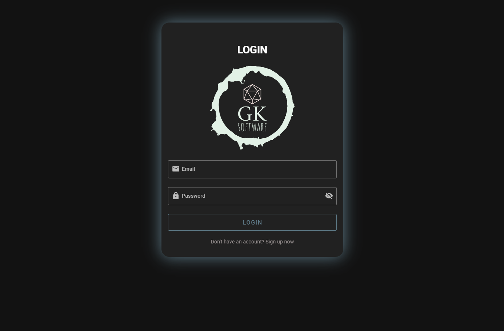
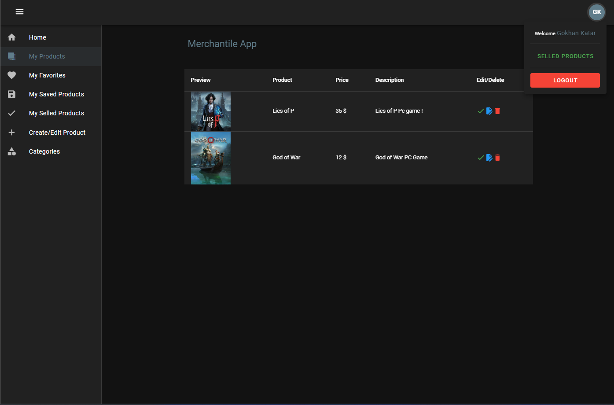
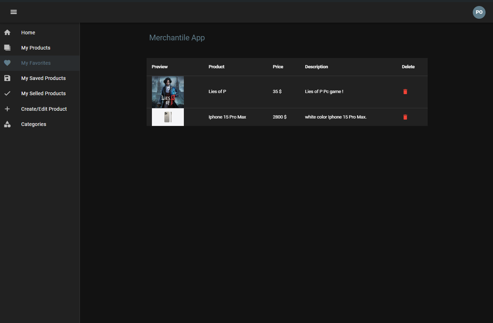
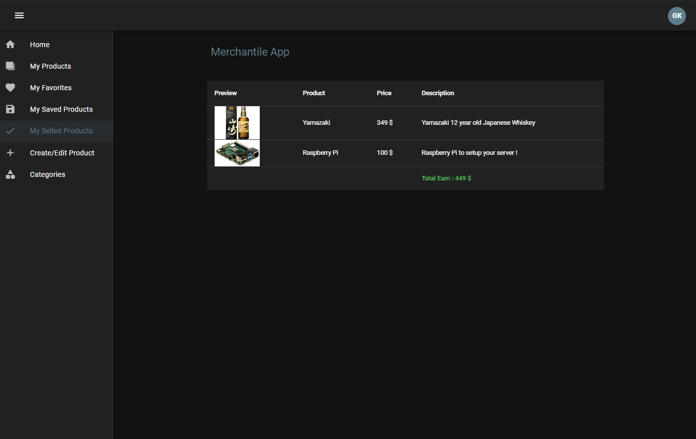
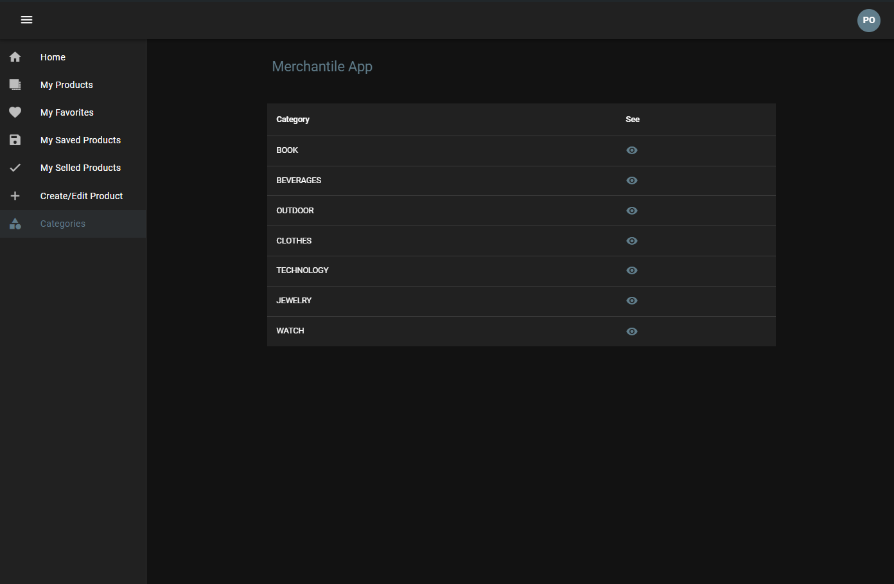
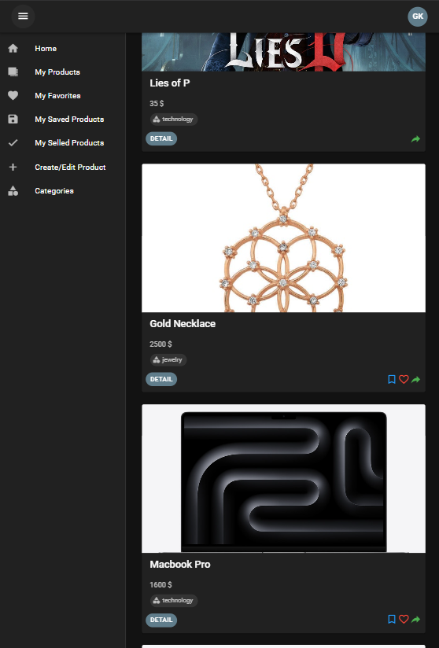
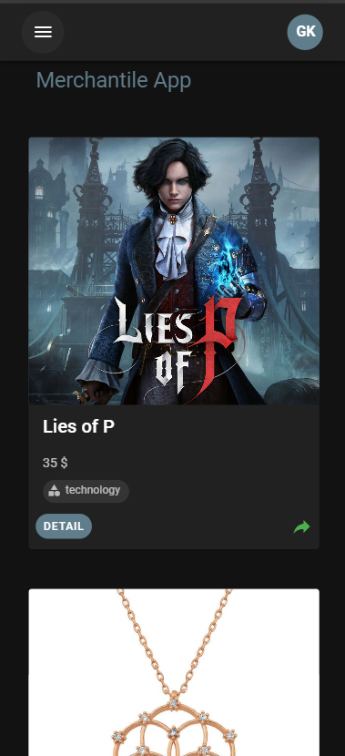

## Merchantile App


## Features

- It is a trading application developed with front-end and back-end.
- Auto logout.
- Add/delete/update product.
- You can save your products, favorite them or mark them as sold and display them on your relevant pages. At the same time, the total of your sold products and your total earnings will be displayed on your sold page.
- View products from relevant categories.
- View the products you have uploaded to the platform together on your "My Products" page

## Technologies

- Vue
- Vite
- Vuetify
- Vue Router
- Vuex
- Vuex-Persist
- Firebase
- Axios

## Login Page (first of all you need to create an account first!)


## if you want to logout


## Your Favorites


## Your Selled Products


## Categories


## Tablet View


## Mobile View


## Installation

To clone the repository, run the following command:

```sh
git clone https://github.com/gokhankatar/merchantile-app

``` 
go to directory

```sh
cd .\merchantile-app\

``` 
and then install npm:

```sh
npm install -f

``` 
open your browser:

```sh
npm run dev
